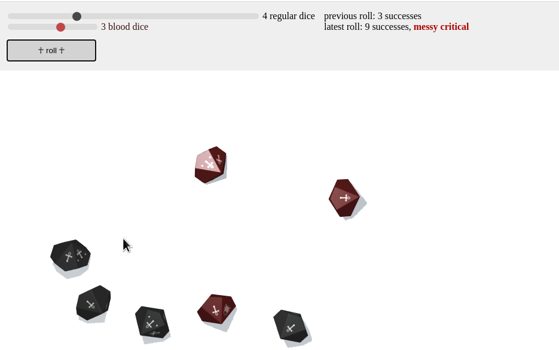

# :vampire: vampire-dice-roller :vampire:

A dice roller for the [Vampire the Masquerade](https://www.modiphius.net/collections/vampire-the-masquerade) tabletop role-playing game.

## Installation

To use the roller, download [the latest release zip](https://github.com/prncc/vampire-dice-roller/archive/v1.0.zip), extract it anywhere, and double click on `vampire-dice-roller.html` to open the app.

## Usage

Select the number of dice to roll using sliders in the upper left corner.
Roll by dragging across the while canvas, or by clicking the "☥ roll ☥" button.
You can see a calculation of the current and previous rolls in the upper right corner.

The app is offline-only, so you have to trust your friends! :) 

## Development

This is a quick and dirty modification of Anton Natarov's [teal 3d dice roller](http://a.teall.info/dice/).
Thanks to Anton for sharing his code.
